## Scope
This project covers a series of operational Kubernetes tasks. The focus areas include cluster and ReplicaSet deployment (manual and automated), pod management, manifest creation and modification, and troubleshooting.

## Environment
- Kubernetes: v1.32.0+k3s1
- kubectl for CLI management and troubleshooting
- Operating System: Alpine Linux 3.16.9
- YAML manifests both authored manually or provided and then corrected during troubleshooting

```
├── README.md
├── Service: Task(s) | Troubleshooting | Building | Log Analysis
│   ├── Host, Node, Pod, Cluster confirmation and validation
|   |   └── Gather facts related to the Cluster, Nodes, Pods
|   |   └── Validate and review the containers, image, update strategy and services
|   |   └── Review the deployment manifest for accuracy
│   ├── Host, Node, Pod, Cluster administration
|   |   └── Horizontally scale pods -> validate
|   |   └── Create new manifests for deployment and kick off deployment
|   |   └── Update deployment images
|   |   └── Delete and administer pods
│   ├── Troubleshooting
|   |   └── Troubleshoot and correct issue with deployment manifest -> create new replicaset -> validate deployed correctly and are hosting the correct amount of pods
```
## Cluster | Nodes | Pods | Manifests configuration, building and troubleshooting

### Host, Node, Pod, Cluster confirmation and validation
- 04012025 Determine node count, cluster information, and the host operating system  
  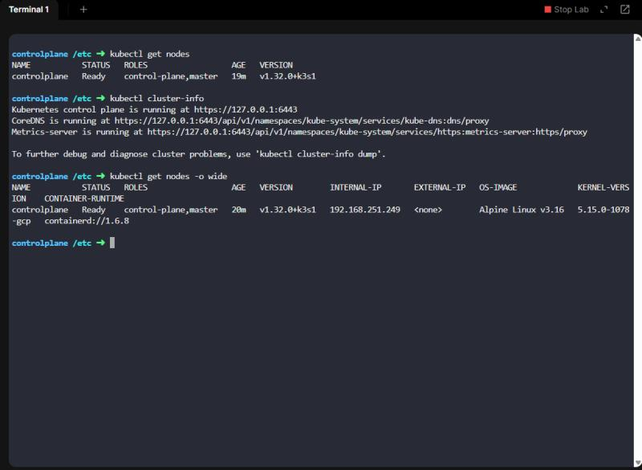
- 04012025 Determine the image and update strategy type used by the deployment
  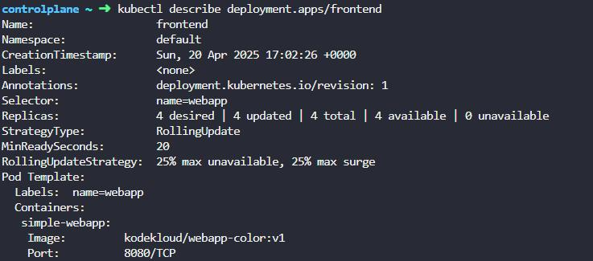
- 04012025 Determine the image used by the pods from the deployment
  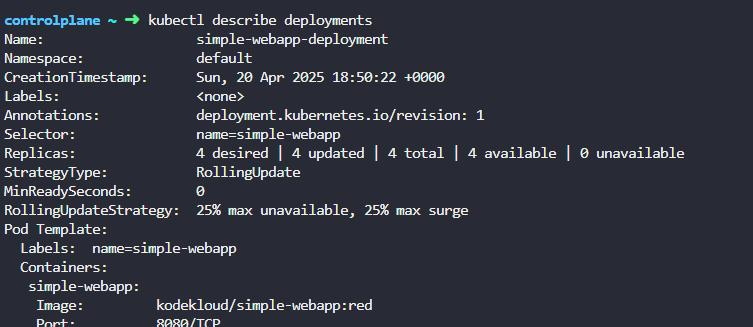
- 04012025 Validate the container providing the image to the underlying pods is correct  
  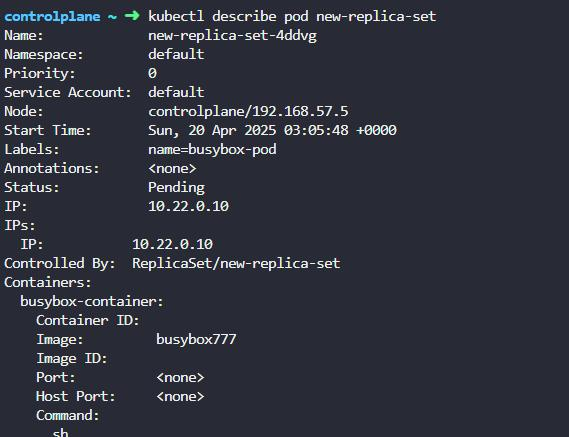
- 04012025 Validate the image used by the pods in the deployment
  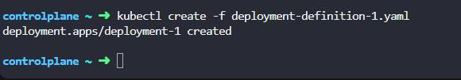
- 04012025 Validate the current number of running pods, deployments and replicasets  
  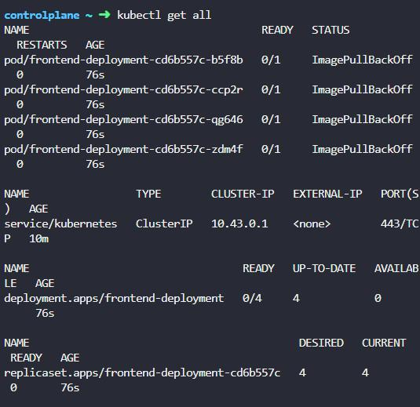
- 04012025 Review the services running on the cluster to determine the endpoints, labels and target port
  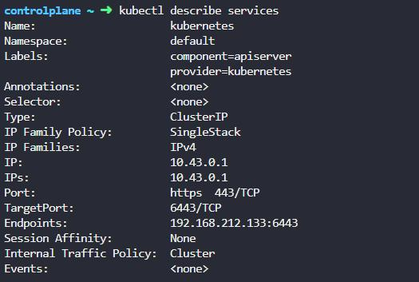
- 04012025 Review the deployment manifest for accuracy
  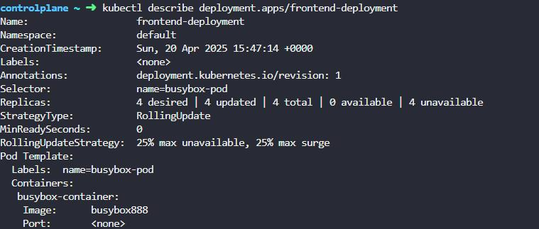

### Host, Node, Pod, Cluster administration
- 04012025 Horizontally scale the number of pods in the replicaset without editing the manifest, confirm that the number of running pods mirrors the updated count  
  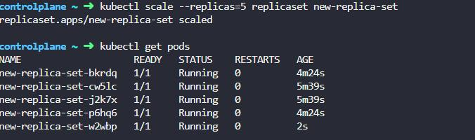
- 04012025 Update the replicaset with the correct image to ensure that the pods are deployed using the correct image
  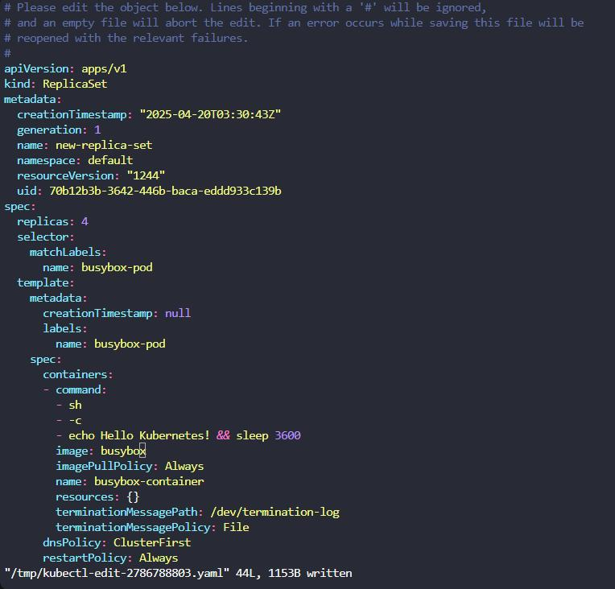
- 04012025 Configure the NodePort manifest for use with the cluster  
  
- 04012025 Created a new manifest and replicaset, updated the number of replicas in the manifest, confirmed the running pods were horizontally scaled after updating the replica count
  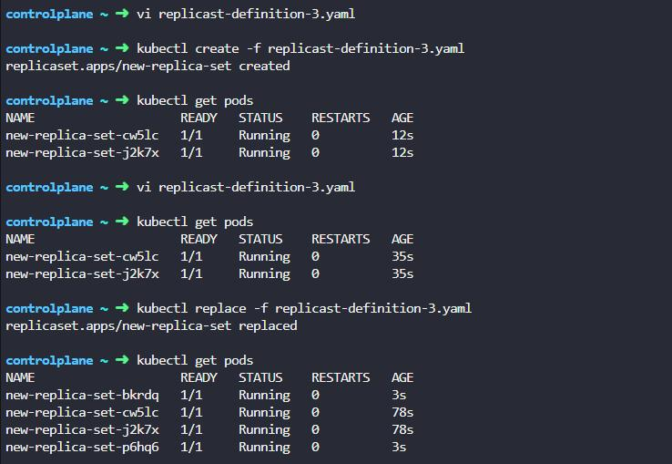
- 04012025 Create a manifest for the new deployment, then create the new deployment off of the manifest
  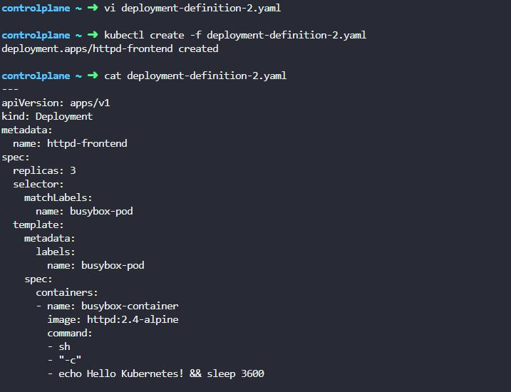
- 04012025 Update the image being used by the deployment
  
- 04012025 Delete a pod, create the manifest file, monitor pod creation, confirm number of pods matches what is in the manifest file
  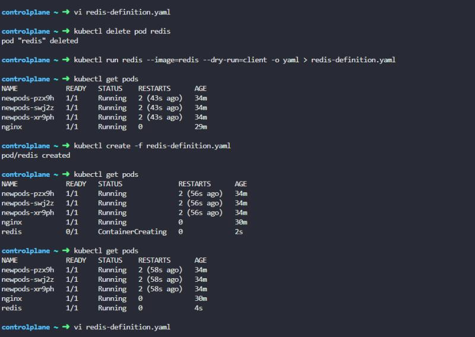

### Troubleshooting
- 04012025 Correct an issue with the manifest, then create a new replicaset, validate both replicasets are now running, have the desired number of pods, and that all pods are ready   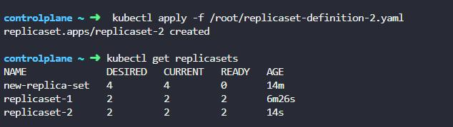
