# Kubernetes
Kubernetes Deployment Automation, Management and Troubleshooting

## Scope
This project completed the following operational goals. Screenshots are provided for each step, as well as what syntax should be used to execute each step, why, and showcase the desired results.

## Steps

### Step 1: Determine the node count, cluster information, and the host operating system.
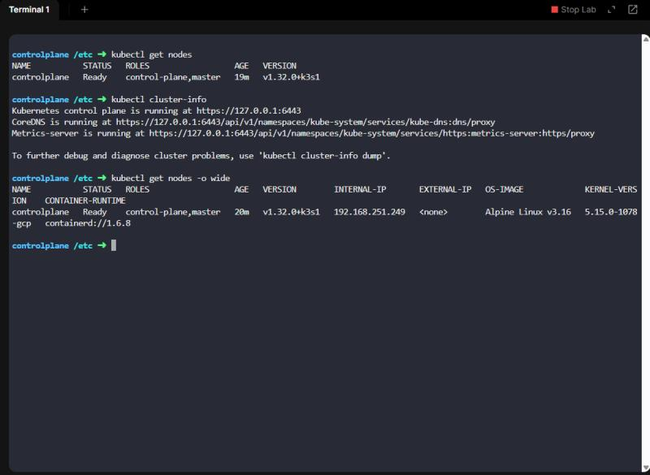

### Step 2: Delete a pod, create manifest file, monitor pod creation status, confirm number of pods running matches what is in the manifest file.
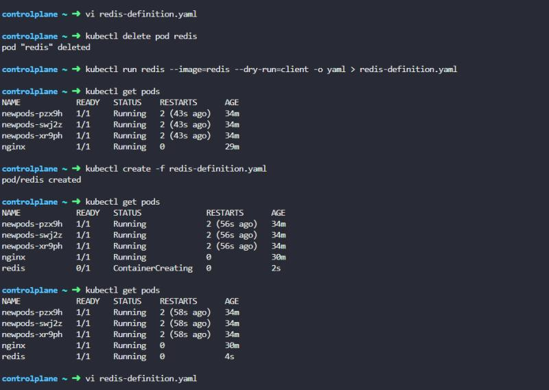

### Step 3: Update the replicaset with the correct image to ensure pods are deployed using the correct image.
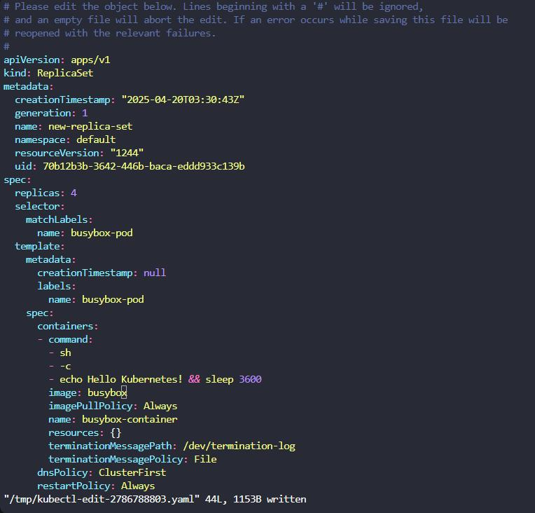

### Step 4: Correct issue with the manifest, then created a new replicaset, validated both replicasets are now running, each has the desired number of pods, and that all pods are ready.
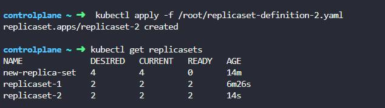

### Step 5: Validate the container providing the image to the underlying pods is correct.
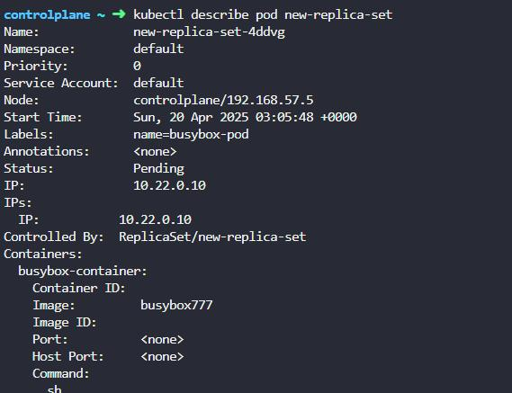

### Step 6: Horizontally scale the number of pods in the replicaset without editing the manifest, confirm the number of running pods mirrors the updated count.

### Step 7: Created manifest and new replicaset, updated number of replicas in the manifest confirmed running pods were horizontally scaled after updating replica count.
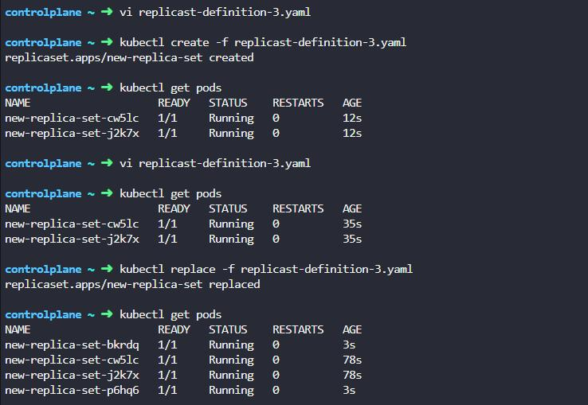

### Step 8: Create the manifest for new deployment, then created new deployment off manifest.
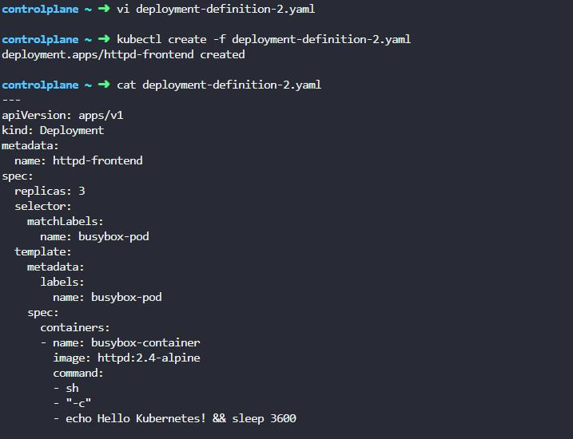

### Step 9: Create the manifest for new deployment, then created new deployment off manifest.
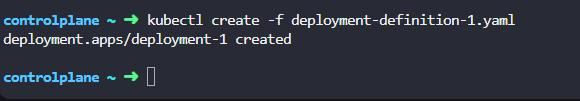

### Step 10: Validate the image used by the pods by the deployment.
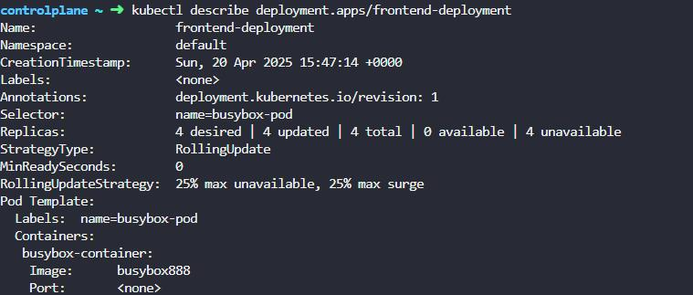

### Step 11: Validate the current number of running pods, dployments and replicasets.
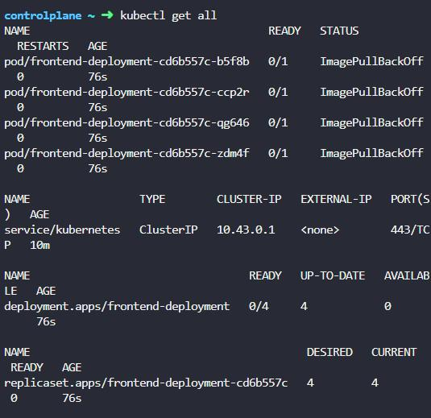

### Step 12: Update the image used by the deployment.
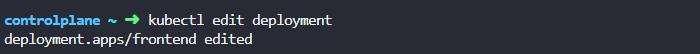

### Step 13: Determine the image and the update strategy type used by the deployment.
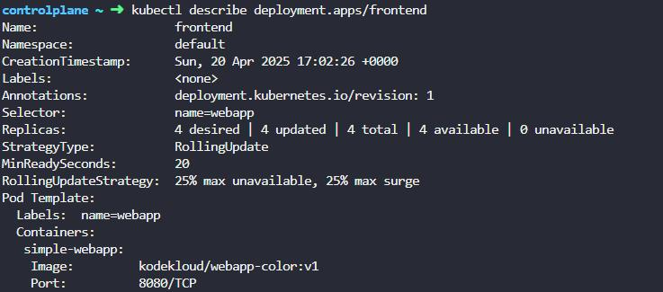

### Step 14: Determine the image used by the pods from the deployment.
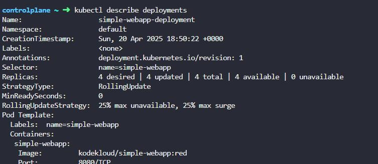

### Step 15: Review services running on the cluster to determine the endpoints, labels and target port.

### Step 16: Configure NodePort manifest for use with the cluster.
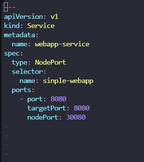
